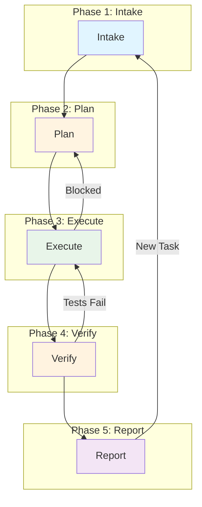

# orrery

## Overview

This repository implements a canonical 5-phase workflow protocol for coding AI agents. The protocol ensures consistency across different AI tools, enables seamless agent-to-agent handoff, and provides clear checkpoints for quality control.

All agents, regardless of which AI tool powers them (Claude, Gemini, Codex, etc.), follow this unified workflow:

**Intake → Plan → Execute → Verify → Report**

### The 5 Phases

1. **Intake**: Fully understand the request, gather context, and clarify ambiguities
2. **Plan**: Break the task into manageable steps with clear dependencies and acceptance criteria
3. **Execute**: Implement the plan steps—write code, make changes, commit at logical points
4. **Verify**: Validate that changes meet acceptance criteria and nothing is broken
5. **Report**: Summarize results clearly for the user or for handoff to another agent

### Key Features

- **Standardized Plan Schema**: All work is tracked in `plan.yaml` files following a common schema
- **Agent Handoff**: Any agent can resume work from another by reading the plan file
- **Cross-Tool Compatibility**: Works seamlessly across different AI coding tools
- **Clear Checkpoints**: Each phase has defined completion criteria
- **Version Control Integration**: Changes are committed incrementally with meaningful messages

## Workflow Diagram



## Documentation

For detailed information about each phase, see:
- [Agent Workflow Protocol](agent/policies/WORKFLOW.md) - Complete workflow specification
- [Plan Schema](agent/schemas/plan-schema.yaml) - YAML schema for plan files
- [Report Schema](agent/schemas/report-schema.yaml) - YAML schema for report files

## Agent Roles

- **Coordinator Agent**: Oversees multi-step work, maintains the plan, dispatches steps to workers
- **Worker Agent**: Executes individual plan steps, loads appropriate skills, reports completion
- **Single-Agent Mode**: One agent acts as both coordinator and worker for simpler tasks

## Orchestration System

The workflow can be split into two modes for automated plan execution:

### Planning Mode (Intake → Plan)

Create a plan file through intake and planning phases, then stop:

```bash
# Use an agent to create a plan
claude -p "Run intake and plan phases. Create a plan file in work/plans/ for: <your task>"
```

Plans are saved to `work/plans/` with the format `YYYY-MM-DD-plan-name.yaml`.

### Orchestration Mode (Execute → Verify → Report)

Run the orchestrator to execute pending plans:

```bash
npm run orchestrate
```

The orchestrator will:
1. Scan `work/plans/` for YAML plan files
2. Identify steps ready to execute (pending with dependencies satisfied)
3. Spawn agent subprocesses to execute steps (supports parallel execution)
4. Update plan statuses and write reports
5. Move completed plans to `work/completed/`

### Configuration

Edit `agent/scripts/config/orchestrator.config.js` to customize:

- **agents**: Command configurations for each AI tool (claude, codex, gemini)
- **concurrency.maxParallel**: Maximum concurrent agent processes (default: 3)
- **paths**: Directories for plans, completed, and reports

## Directory Structure

```
orrery/
├── agent/
│   ├── policies/
│   │   └── WORKFLOW.md          # Workflow protocol specification
│   ├── schemas/
│   │   ├── plan-schema.yaml     # Plan file schema
│   │   └── report-schema.yaml   # Report file schema
│   ├── skills/                  # Skill instructions for each phase
│   │   ├── intake/
│   │   ├── plan/
│   │   ├── execute/
│   │   ├── verify/
│   │   └── report/
│   └── scripts/
│       ├── orchestrate.js       # Plan orchestrator
│       ├── clone-agent-skills.js
│       ├── lib/                 # Orchestrator modules
│       └── config/              # Orchestrator configuration
├── work/
│   ├── plans/                   # Active plan files
│   ├── completed/               # Archived completed plans
│   └── reports/                 # Step execution reports
└── package.json
```

## Quick Start

```bash
# Install dependencies
npm install

# Clone skills to agent-specific directories
npm run clone-agent-skills

# Run the orchestrator (processes plans in work/plans/)
npm run orchestrate
```
