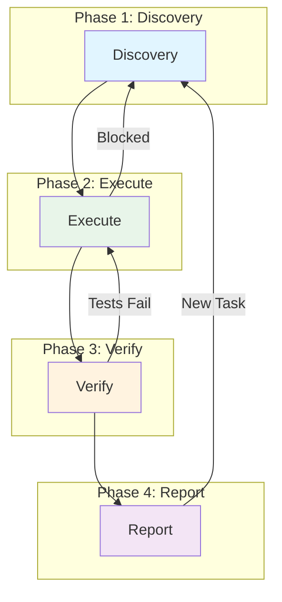

# orrery

## Overview

This repository implements a canonical 4-phase workflow protocol for coding AI agents. The protocol ensures consistency across different AI tools, enables seamless agent-to-agent handoff, and provides clear checkpoints for quality control.

All agents, regardless of which AI tool powers them (Claude, Gemini, Codex, etc.), follow this unified workflow:

**Discovery → Execute → Verify → Report**

### The 4 Phases

1. **Discovery**: Fully understand the request and produce a plan with clear dependencies and acceptance criteria
2. **Execute**: Implement the plan steps—write code, make changes, commit at logical points
3. **Verify**: Validate that changes meet acceptance criteria and nothing is broken
4. **Report**: Summarize results clearly for the user or for handoff to another agent

### Key Features

- **Standardized Plan Schema**: All work is tracked in `plan.yaml` files following a common schema
- **Agent Handoff**: Any agent can resume work from another by reading the plan file
- **Cross-Tool Compatibility**: Works seamlessly across different AI coding tools
- **Clear Checkpoints**: Each phase has defined completion criteria
- **Version Control Integration**: Changes are committed incrementally with meaningful messages

## Workflow Diagram



## Documentation

For detailed information about each phase, see:
- [Agent Workflow Protocol](agent/policies/WORKFLOW.md) - Complete workflow specification
- [Plan Schema](agent/schemas/plan-schema.yaml) - YAML schema for plan files
- [Report Schema](agent/schemas/report-schema.yaml) - YAML schema for report files

## Agent Roles

- **Coordinator Agent**: Oversees multi-step work, maintains the plan, dispatches steps to workers
- **Worker Agent**: Executes individual plan steps, loads appropriate skills, reports completion
- **Single-Agent Mode**: One agent acts as both coordinator and worker for simpler tasks

## Orchestration System

The workflow can be split into two modes for automated plan execution:

### Planning Mode (Discovery)

Create a plan file through Discovery, then stop:

```bash
# Use an agent to create a plan
claude -p "Run discovery. Create a plan file in .agent-work/plans/ for: <your task>"
```

Plans are saved to `.agent-work/plans/` with the format `YYYY-MM-DD-plan-name.yaml`.

### Orchestration Mode (Execute → Verify → Report)

Run the orchestrator to execute pending plans:

```bash
orrery exec
```

The orchestrator will:
1. Scan `.agent-work/plans/` for YAML plan files
2. Identify steps ready to execute (pending with dependencies satisfied)
3. Spawn agent subprocesses to execute steps (supports parallel execution)
4. Update plan statuses and write reports
5. Move completed plans to `.agent-work/completed/`

### Configuration

Edit `agent/scripts/config/orchestrator.config.js` to customize:

- **agents**: Command configurations for each AI tool (claude, codex, gemini)
- **concurrency.maxParallel**: Maximum concurrent agent processes (default: 3)
- **paths**: Directories for plans, completed, and reports

## Directory Structure

```
orrery/
├── agent/
│   ├── policies/
│   │   └── WORKFLOW.md          # Workflow protocol specification
│   ├── schemas/
│   │   ├── plan-schema.yaml     # Plan file schema
│   │   └── report-schema.yaml   # Report file schema
│   ├── skills/                  # Skill instructions for each phase
│   │   ├── discovery/
│   │   ├── simulate/
│   │   ├── execute/
│   │   ├── verify/
│   │   └── report/
│   └── scripts/
│       ├── orchestrate.js       # Plan orchestrator
│       ├── clone-agent-skills.js
│       ├── lib/                 # Orchestrator modules
│       └── config/              # Orchestrator configuration
└── package.json
```

Projects that use orrery will have a `.agent-work/` folder created in the
project root:

```
.agent-work/
├── plans/                       # Active plan files
├── completed/                   # Archived completed plans
└── reports/                     # Step execution reports
```

## Installation

Global install:

```bash
npm install -g orrery
```

No global install (one-off usage):

```bash
npx orrery --help
```

## Quick Start

```bash
# 1) Install skills into your agent directories
orrery install-skills

# 2) Ask an agent to create a plan in .agent-work/plans/
claude -p "Run discovery. Create a plan file in .agent-work/plans/ for: <your task>"

# 3) Run the orchestrator in your project
orrery exec
```

## Skill Installation Model

`orrery install-skills` copies the built-in skill instructions from this package
into each installed agent's skills directory:

- Claude: `~/.claude/skills/`
- Codex: `~/.codex/skills/`
- Gemini: `~/.gemini/skills/`

This keeps skills self-contained and lets agents use them without the project
needing to know about orrery.

## CLI Usage

Install skills (auto-detect agents):

```bash
orrery install-skills
```

Install skills for a specific agent:

```bash
orrery install-skills --agent claude
```

Preview what would be copied:

```bash
orrery install-skills --dry-run
```

Run orchestration for all plans:

```bash
orrery exec
```

Run a specific plan:

```bash
orrery exec --plan .agent-work/plans/2026-01-14-some-plan.yaml
```

Check plan status:

```bash
orrery status
```

Show details for a single plan:

```bash
orrery status --plan .agent-work/plans/2026-01-14-some-plan.yaml
```
